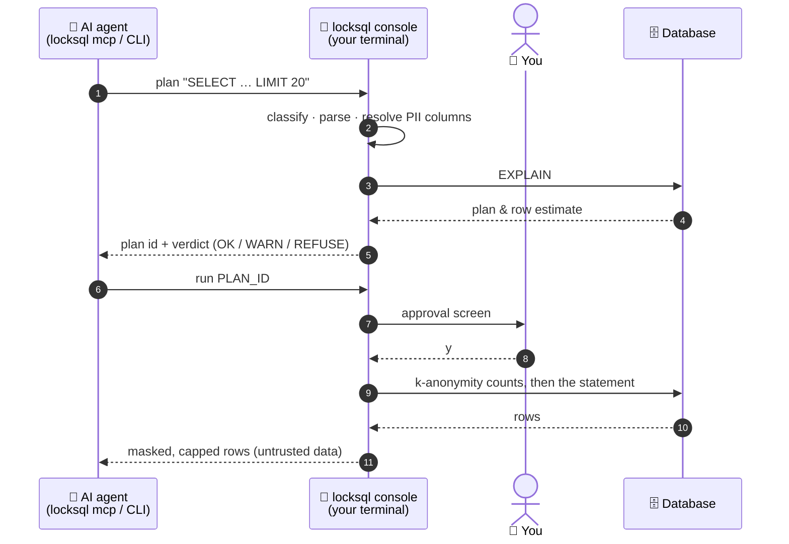

<p align="center">
  <picture>
    <source media="(prefers-color-scheme: dark)" srcset="docs/assets/banner-dark.svg">
    
  </picture>
</p>

<p align="center">
  <a href="https://github.com/DavidGodefroid/locksql/actions/workflows/ci.yml"></a>
  
  
  
  <a href="LICENSE"></a>
</p>

<p align="center">
  <b>Let Claude Code, Codex, Cursor or Gemini CLI query your databases<br>
  without ever handing them a password.</b>
</p>

<p align="center">
  <a href="#quick-start">Quick start</a> ·
  <a href="#how-it-works">How it works</a> ·
  <a href="#safety-model">Safety model</a> ·
  <a href="#configuration">Configuration</a> ·
  <a href="docs/usage.md">Docs</a>
</p>

---

locksql puts a **human-held console** between your AI agent and MariaDB, MySQL,
PostgreSQL or SQLite. The agent proposes SQL; the console, running in a
terminal you keep in view, holds the credentials, parses and weighs every
statement, masks personal data and waits for **your** approval. The agent
never sees a credential and never opens a connection.

> [!NOTE]
> **Pre-release** (`v0.1.x`). See [Install](#install).

## Why locksql?

Agent tools already ask before running a command, but that approval lives
inside the agent's own process: the agent holds the credentials, the prompt
can be configured away, and a long session trains you to press "yes".
locksql moves the decision **out of the agent**.

| | In-agent approval | locksql |
|---|:---:|:---:|
| Agent never sees the DB password | ❌ | ✅ |
| Agent has no DB connection | ❌ | ✅ |
| Approval cannot be switched off from the agent side | ❌ | ✅ |
| Every read parsed down to its source columns | ❌ | ✅ |
| `EXPLAIN` cost check before running | ❌ | ✅ |
| PII masked on its source column, not its label | ❌ | ✅ |
| k-anonymity on PII filters and aggregates | ❌ | ✅ |
| Policy loosening needs a human confirmation | ❌ | ✅ |
| Append-only audit log | ❌ | ✅ |

In-agent approval is a convenience; a separate approval process is a boundary.

## Highlights

<table>
<tr>
<td width="50%" valign="top">

**🔑 One key holder**<br>
Credentials are typed at console start or read from the OS keychain. Never in
argv, env, files, logs, the socket or error messages.

</td>
<td width="50%" valign="top">

**👤 Human in the loop**<br>
Every statement is shown with its plan, cost and PII footprint. On production
you type the profile name, not `y`.

</td>
</tr>
<tr>
<td valign="top">

**🧱 Fail closed**<br>
A dialect-aware classifier refuses anything it cannot classify with certainty.
Reads are parsed in full; unknown syntax is refused.

</td>
<td valign="top">

**🕶️ PII masking**<br>
Every output column is traced to its source through aliases, CTEs, unions and
joins, then masked (`redact` by default, `partial` or `email`).

</td>
</tr>
<tr>
<td valign="top">

**⚖️ Weight check**<br>
`LIMIT` is mandatory, `EXPLAIN` runs first, and plans that would scan too many rows
are refused before they run.

</td>
<td valign="top">

**🛡️ OS separation**<br>
`locksql install` runs the console under its own account; the kernel checks
every peer on the socket.

</td>
</tr>
</table>

## Quick start

```sh
# 1. Install (see Install below for packages, checksums and signatures)
curl -fsSL https://raw.githubusercontent.com/DavidGodefroid/locksql/main/scripts/install.sh | sh

# 2. Wire your agents and set up the console account
locksql

# 3. In the locksql session (a separate login), start the console
#    (keep this terminal open)
locksql console --project DIR

# 4. In your agent, anywhere: "how many orders were placed yesterday on dev?"
#    Approve or deny each query in the console.
```

Bare `locksql` in a terminal wires every installed agent (Claude Code, Codex,
Gemini CLI, Cursor) for your user account, so that they work from any
directory. The console must run in a separate account, so when that is not
set up yet it explains why and offers to run `sudo locksql install`. It then
prints the next steps: put your database profile in the project's
`.locksql/config.toml` (`locksql init <agent>` writes a commented example)
and run `locksql console --project DIR` in the `locksql` session. Later runs
only wire agents installed since. Run in the service account, bare `locksql`
starts the console.

The setup is described in [docs/usage.md](docs/usage.md) (`sudo locksql
install`, then `locksql doctor`; project mode with `.locksql/config.toml`
committed with the repository). Both accounts read the project config.

## How it works

Two processes in two terminals. Only the console holds the key.



1. The agent submits SQL with `locksql plan` (or the `locksql_plan` MCP tool).
   The console classifies it, parses and analyses a read down to the source
   column of every output, runs `EXPLAIN`, weighs the plan and returns a
   one-shot plan id with a verdict (`OK`, `WARN` or `REFUSE`).
2. The agent calls `locksql run PLAN_ID`. The console shows you the approval
   screen and waits:

   ```
   ╭─ DEV · 127.0.0.1 / app · user alice · tier read ─────
   │ requested by uid 1000 (alice) · pid 48211 (claude)
   │
   │   SELECT id, email FROM customers WHERE country = 'BE' LIMIT 20
   │
   │ class READ · EXPLAIN: customers range ~410 · est. 410 rows examined · verdict OK
   │ reads: app.customers
   │ returns at most 20 rows
   │ PII columns touched: customers.email (select)
   │ masked outputs: email → redact
   │ PII: masked (4 column rules; detectors: email, phone, iban, card)
   ╰─ Approve? [y/N]
   ```

3. On approval the console runs its k-anonymity counts when the statement
   filters, groups or aggregates PII, then the statement itself, masks PII,
   caps the output and hands the rows back to the agent, framed as untrusted
   data.

<details>
<summary>Process layout</summary>

```
 Your terminal                                    Agent side
 ┌───────────────────────────────────┐            ┌──────────────────────────────┐
 │ locksql console --profile dev     │  local     │ locksql mcp   (stdio MCP)    │◄── AI agent
 │  credentials (ask | OS keychain)  │  socket    │ locksql plan|run|status|pii  │◄── AI via shell
 │  policy · classifier · EXPLAIN    │◄──────────►│ no secrets, no DB connection │
 │  approval prompt · masking · audit│  JSON-RPC  └──────────────────────────────┘
 └─────────────────┬─────────────────┘
                   │ native protocol
                   ▼
        MariaDB · MySQL · PostgreSQL · SQLite
```

</details>

Full walkthrough: [docs/usage.md](docs/usage.md).

## Engines

| Engine | Versions | Read-only session (tier `read`) | Server-side timeout | Plan source |
|---|---|---|---|---|
| `mariadb` | 10.1+ (tested 10.11, 11.4) | `SET SESSION TRANSACTION READ ONLY` + `START TRANSACTION READ ONLY` | `max_statement_time` + `KILL QUERY` | `EXPLAIN FORMAT=JSON` |
| `mysql` | 8.0+ (tested 8.0, 8.4) | same as MariaDB | `max_execution_time` + `KILL QUERY` | `EXPLAIN FORMAT=JSON` |
| `postgres` | 13+ (tested 13, 17) | `SET SESSION CHARACTERISTICS AS TRANSACTION READ ONLY` + `BEGIN READ ONLY` | `statement_timeout` + cancel request | `EXPLAIN (FORMAT JSON, VERBOSE)` |
| `sqlite` | 3 (pure Go, in-process) | `mode=ro` + `query_only` | interrupt on deadline | `EXPLAIN QUERY PLAN` + `sqlite_stat1` |

All engines are pure Go: the binary is built with `CGO_ENABLED=0`. locksql
supports Linux and macOS only, on amd64 and arm64.

## Safety model

The console is the enforcement point. Skills, rules and MCP tool descriptions
only guide the agent; the console's checks are the guarantee.

- **One key holder.** Credentials are typed at console start (no echo) or read
  from the OS keychain. They never appear in argv, environment, files, logs,
  the socket protocol or error messages. The console disables core dumps.
  `credentials_ttl` makes it ask again after a set time (vault leases).
- **OS separation.** `locksql install` creates a `locksql` console account
  and a `locksql-clients` group: the console runs as that account in its own
  login session, the agent's account only reaches its socket, and the kernel
  checks every peer. The console refuses to start without this setup, since
  an agent in the console's own account could read or type into its terminal.
- **Human approval.** Every statement is shown and approved in the console
  terminal; no socket method can approve. On a production profile you type the
  profile name, not `y`. Pending keystrokes are flushed before each prompt, so
  type-ahead never approves. No answer within 5 minutes means denied.
- **Fail closed.** A dialect-aware classifier refuses anything it cannot
  classify with certainty: several statements, comments, variables, bind
  parameters, file and OS access, sleeps and locks, session tampering. Reads
  are limited to `SELECT`, `WITH ... SELECT` and `EXPLAIN SELECT`, parsed in
  full: unknown syntax, functions outside an allowlist and system schemas
  are refused.
- **Tiers.** `read < write < ddl < admin`; the default is `read`. Tier `read`
  is also enforced server side (read-only session and transaction).
- **Weight check.** A READ statement must carry `LIMIT n` with `n <= max_rows`.
  The console runs `EXPLAIN` and refuses statements that would examine too
  many rows (or cost more than `explain_cost_refuse`); REFUSE cannot be
  overridden from the console.
- **PII masking.** At every start the console scans the schema and proposes
  rules for columns that look like personal data (multilingual names and
  types) and that no rule names yet. Every output column is resolved to its
  source columns through aliases, functions, subqueries, CTEs, unions, joins
  and `*`, and masked on that source, not on its label; the engine's origin
  metadata is a second check, and a result whose columns do not match the
  analysis is dropped. Value detectors (email, phone, IBAN, card, opt-in
  national ids) mask the other cells. Mask modes: `redact` (the default),
  `partial`, `email`. Quasi-identifiers (birth date, postal code, gender) are
  never masked unless you accept them one by one, since masking blocks range
  filters, `LIKE` and `ORDER BY` on the column.
- **Statement text.** While mask rules exist, the views that hold the text of
  past statements are refused, in reads and in writes: `pg_stat_statements`
  and `pg_stat_activity`; on MySQL and MariaDB,
  `information_schema.PROCESSLIST`, every `performance_schema` and `sys`
  relation, `mysql.general_log` and `mysql.slow_log`.
- **PII usage.** PII columns may be selected, counted, joined with `=` and
  filtered with `=`, `IN (literals)` or `IS NULL`. Expressions over them,
  `LIKE`, ranges and `ORDER BY` are refused. A filter, grouping or aggregate on
  PII must cover at least `k_anonymity` rows (default 5, production 10).
- **Quiet failures.** Clients get a generic message, never the server's error
  text, and no timings; `query.run` answers on a 250 ms quantum.
- **The AI tightens, the human loosens.** Agents may add mask rules and
  request changes. A config edit that loosens the policy (higher tier, larger
  limits, new host, removed PII rule, ...) only takes effect after you
  confirm it in the console.
- **Audit.** Every login, policy change, refusal, decision, catalog read and
  logout is appended to a JSONL audit log (mode 0600). Never secrets, never
  row data.

Details and threat model: [docs/security-model.md](docs/security-model.md).

## Configuration

Profiles live in `.locksql/config.toml` at the project root (found by walking
up from the current directory) and in `<user config dir>/locksql/config.toml`.
A project profile wins over a user profile of the same name. No file ever
holds a secret: keys named like `password`, `passwd`, `pwd`, `secret` or
`token`, and DSNs with an embedded password, are refused.

```toml
[profiles.uat]
engine      = "mariadb"             # mariadb | mysql | postgres | sqlite
host        = "db.uat.example.com"  # or path = "app.db" for sqlite
port        = 3306                  # default 3306, or 5432 for postgres
user        = ""                    # empty: asked at console start
database    = ""                    # empty: chosen per query (--db)
credentials = "ask"                 # ask | keychain
credentials_ttl = "20m"             # optional: ask for the secret again
tier        = "read"                # read | write | ddl | admin
production  = false
detectors   = ["email", "phone", "iban", "card", "be_niss"]

[profiles.uat.limits]
statement_timeout   = "30s"
explain_rows_warn   = 100000
explain_rows_refuse = 1000000
max_rows            = 200
max_cell_chars      = 200
max_output_bytes    = 65536
k_anonymity         = 5
explain_cost_refuse = 0             # engine cost units; 0 = off
```

<details>
<summary>All profile keys</summary>

| Key | Default | Notes |
|---|---|---|
| `engine` | required | `mariadb`, `mysql`, `postgres`, `sqlite` |
| `host`, `port` | required host; port 3306 / 5432 | a host starting with `/` is a Unix socket (MariaDB/MySQL) |
| `path` | required for sqlite | relative to the project root; the file is never created |
| `user` | asked at start | |
| `database` | none | the default database for queries |
| `credentials` | `ask` | `keychain` offers to save the secret after the first successful login; `locksql forget --profile P` removes it |
| `credentials_ttl` | none | a duration of at least `1m` (`"20m"`, `"1h"`): the connection is closed and the secret asked again once it is that old |
| `tier` | `read` | highest statement class allowed |
| `production` | `false` | stricter limits, typed approval, `--skip-permissions` ignored |
| `detectors` | `email`, `phone`, `iban`, `card` | also `be_niss`, `fr_nir`, `nl_bsn`, `us_ssn`; `[]` disables them |
| `limits.statement_timeout` | 30s (production 10s) | |
| `limits.explain_rows_warn` | 100 000 (production 20 000) | |
| `limits.explain_rows_refuse` | 1 000 000 (production 200 000) | |
| `limits.max_rows` | 200 | upper bound for `LIMIT n` and for returned rows |
| `limits.max_cell_chars` | 200 | longer cells are cut with `…` |
| `limits.max_output_bytes` | 65 536 | output is cut with a marker |
| `limits.k_anonymity` | 5 (production 10) | smallest row count a PII filter, a group or an aggregate of a PII column may cover; lowering it is a loosening |
| `limits.explain_cost_refuse` | 0 (off) | refuse plans above this total cost, in the engine's own units; SQLite reports no cost and is not checked |

</details>

### PII rules

PII column rules live in `.locksql/pii.toml` inside a project, and in
`<user config dir>/locksql/pii.toml` (`~/.config/locksql/pii.toml` on Linux)
elsewhere:

```toml
[[mask]]
column = "app.users.email"            # db.table.column, * per segment
mode   = "email"                      # j***@example.com
[[mask]]
column = "app.users.customer_ref"
mode   = "partial"                    # j***(12)
[[mask]]
column = "*.*.recipient_reference"    # <redacted> (default)
[[allow]]                             # explicit exception: never mask
column = "app.templates.name"
```

| Mode | Output | Notes |
|---|---|---|
| `redact` (default) | `<redacted>` | a rule without `mode` is `redact` |
| `partial` | `j***(12)` | first character and length |
| `email` | `j***@example.com` | first character and domain; other values as `partial` |

A column covered by several rules with different modes is redacted. Changing
a mode is a loosening unless the new mode is `redact`.

`mode = "hash"` is no longer a mode: a rules file that uses it is rejected
(`unknown mode "hash" (want redact, partial or email)`).

On PostgreSQL the first segment is the schema (`public.users.email`).

## `--skip-permissions`

`locksql console --profile dev --skip-permissions` auto-approves statements
that the tier and the weight check allow. It exists for fast local
iteration, and it is deliberately narrow:

- it is a console flag only; no client or config file can turn it on;
- it is **ignored on production profiles** (the console says so and prompts
  as usual);
- it never auto-approves an unmasked query and never overrides a REFUSE
  verdict;
- every console line is prefixed with `AUTO-APPROVE` while it is in effect,
  and each auto-approval is audited with `decision: "auto"`.

## Limitations

- **The console runs only in a separate account.** `sudo locksql install`
  sets it up; `locksql console` refuses to start without it and names
  `locksql doctor`. Run `locksql doctor` to see what your machine allows.
  Malware running as the console account, or as root, is out of scope.
- **k-anonymity is a query-set-size control.** It refuses a single query
  whose PII filter covers fewer than `k` rows; it does not stop differencing
  attacks that combine several approved queries.
- **TLS is not configurable yet.** PostgreSQL, MariaDB and MySQL connect like
  PostgreSQL's `sslmode=prefer`: encrypted when the server offers TLS, plain
  otherwise, and the certificate is not verified, so an active attacker on the
  path can intercept or downgrade the connection. A plain TCP connection is
  reported as a warning. This mode gives no protection against such an
  attacker, the password included: over the unverified TLS connection the
  attacker can ask for it in clear (MySQL and MariaDB `mysql_clear_password`
  or a `caching_sha2_password` full authentication), and PostgreSQL sends
  it in clear to a server that asks for cleartext authentication, with or
  without TLS. On a plain MySQL/MariaDB TCP connection locksql refuses the
  authentications that would hand the password over (clear text, or RSA
  encryption with a key the server sends: `sha256_password` and a
  `caching_sha2_password` full authentication), so a MySQL 8 account on a
  server without TLS can log in only while the server's authentication cache
  holds it. Use an SSH tunnel (`ssh -L`) or a Unix socket for remote
  servers.
- One console per profile and project, one request at a time. No remote or
  shared consoles, no data export.

## Documentation

| | |
|---|---|
| 📘 [docs/usage.md](docs/usage.md) | console, client commands, MCP server, agent integration |
| 🛡️ [docs/security-model.md](docs/security-model.md) | threat model and mitigations, and an upstream recommendation (PII encrypted at rest with a blind index) |
| 🚨 [SECURITY.md](SECURITY.md) | reporting a vulnerability |
| 🧑‍💻 [CONTRIBUTING.md](CONTRIBUTING.md) | building and testing |

## Install

Every release ships a static binary for Linux and macOS (amd64, arm64),
Linux packages, a `checksums.txt` and its cosign signature. No Go toolchain is
needed.

**Script (Linux, macOS).** Downloads the archive for your OS and architecture,
checks it against `checksums.txt` (and the signature when `cosign` is on
PATH), then installs `/usr/local/bin/locksql`, with `sudo` if needed:

```sh
curl -fsSLO https://raw.githubusercontent.com/DavidGodefroid/locksql/main/scripts/install.sh
less install.sh                     # read it first
sh install.sh                       # LOCKSQL_VERSION=v0.1.1 to pin a version
```

`LOCKSQL_INSTALL_DIR=~/.local/bin` installs without `sudo`, but the binary is
then owned by your account and `locksql doctor` warns: in separated mode, the
console must run a binary the agent cannot replace (`sudo locksql install`
copies it to `/usr/local/bin`). To upgrade, run the script again.

**Debian, Ubuntu, Fedora, RHEL, Alpine.** Packages install
`/usr/bin/locksql`, owned by root. Copy-paste, the latest version and your
architecture are detected:

```sh
V=$(curl -fsSLI -o /dev/null -w '%{url_effective}' https://github.com/DavidGodefroid/locksql/releases/latest); V=${V##*/v}
A=$(uname -m | sed 's/x86_64/amd64/; s/aarch64/arm64/')
U=https://github.com/DavidGodefroid/locksql/releases/download/v$V/locksql_${V}_linux_$A

# Debian, Ubuntu
curl -fsSLO $U.deb && sudo apt install ./locksql_${V}_linux_$A.deb
# Fedora, RHEL
sudo dnf install $U.rpm
# Alpine
curl -fsSLO $U.apk && sudo apk add --allow-untrusted ./locksql_${V}_linux_$A.apk
```

To upgrade, run the same lines again; to remove, `sudo apt remove locksql`
(or `dnf remove`, `apk del`).

**By hand.** Download `locksql_<version>_<os>_<arch>.tar.gz`, `checksums.txt`
and `checksums.txt.sigstore.json`, then:

```sh
cosign verify-blob --bundle checksums.txt.sigstore.json \
  --certificate-identity-regexp '^https://github.com/DavidGodefroid/locksql/' \
  --certificate-oidc-issuer https://token.actions.githubusercontent.com \
  checksums.txt
sha256sum --ignore-missing -c checksums.txt   # macOS: shasum -a 256 --ignore-missing -c checksums.txt
tar -xzf locksql_<version>_<os>_<arch>.tar.gz locksql
sudo install -m 0755 locksql /usr/local/bin/locksql
```

**From source.** `go install github.com/DavidGodefroid/locksql/cmd/locksql@latest`
(Go 1.26 or later).

## Build

```sh
CGO_ENABLED=0 go build ./cmd/locksql
```

Requires Go 1.26 or later.

## Licence

Apache License 2.0. See [LICENSE](LICENSE) and [NOTICE](NOTICE).
